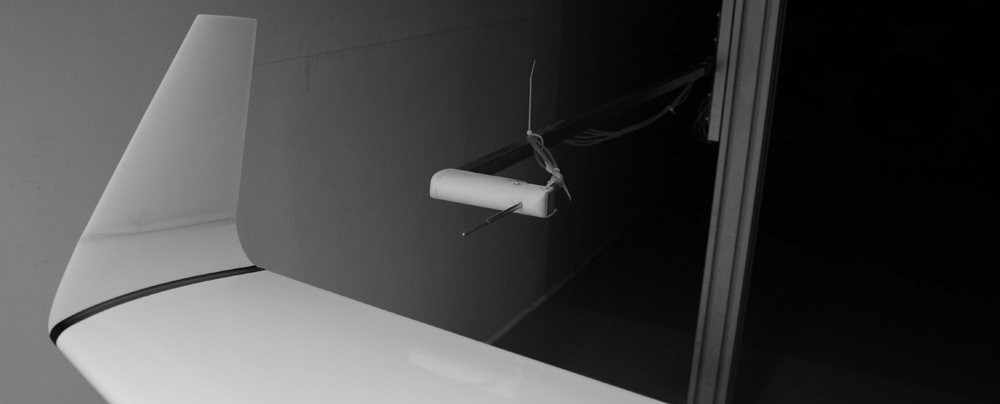

# Wing and winglet

This example is for a wing + winglet combination, showing how to use stl geometries with snappyHexMesh. The Reynolds number is about 233,000 and experimental data (as well as additional gemetrical considerations) is available ([here](https://reposit.haw-hamburg.de/bitstream/20.500.12738/6042/1/A_comparative_study_between_winglet_and_raked_wingtip_wing_configurations.pdf)). The image below shows the wing + winglet mounted in the wind tunnel.



# Usage

To set up the case, use the following command:

```bash
python3 OpenFOAMCaseGenerator.py --input=WingAndWinglet
```

# Expected results

For an angle of attack of 5, we expect a lift coefficient of around 0.38